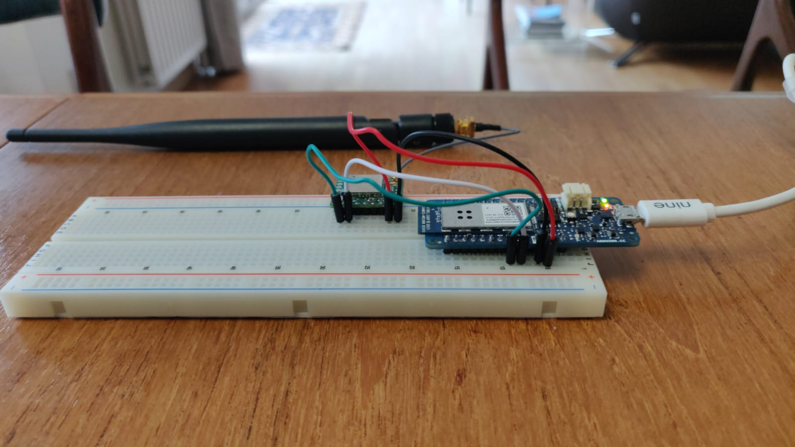

# Lab Sigfox

Lab Sigfox using the BKRWS01 and Arduino boards

## About this Classroom

The goal of this laboratory is to understand how to get started with Sigfox.
For this lab, we will be using Arduino boards (Arduino Uno and MKR1000 + a Sigfox Module BKRWS01)


This lab has been done for Github Classroom. To enter in the classroom, you should have received the link to get the invitation.

The different steps will be:
* Install Arduino IDE and the dependencies
* Understand Arduino basics
* First program
* Adding sensors
* Send and receive your first "Hello World"
* Send some sensors data
* Set a callback to push your data to an external service
* Visualize your data using an open source app
* Understand Sigfox Geolocation service

## Prerequisites

**I assume that you all have a Github account and git installed locally.**

Click on the classroom invitation link.

Authorize the application to access to your Github account:


Create or join a team, name the team with your two names (or have fun).


## Step 1: Install Arduino IDE and the dependencies

Go to https://www.arduino.cc/en/main/software and download the Arduino IDE:


Go to Tools -> Boards -> Boards Manager

**MKR Boards**

Search for Arduino/Genuino&MKR1000


## Step 2: Understand Arduino basics

When you create a new project, you will always see two functions:
* The Setup() function:

This function is called when your board starts or is reset and will be called only once.
It will let you declare your variables, pins, used libraries, etc...

* The Loop() function:

The loop() function does precisely what its name suggests, and loops consecutively, allowing your program to change and respond. Use it to actively control the Arduino board.

If you need to understand more the Arduino syntax, please visit https://www.arduino.cc/en/Reference/HomePage

## First Program

Open the Workspace/Blink/Blink.ino file with Arduino IDE

You should see the following program:
```
// the setup function runs once when you press reset or power the board
void setup() {
  // initialize digital pin LED_BUILTIN (pin 13) as an output.
  pinMode(LED_BUILTIN, OUTPUT);
}

// the loop function runs over and over again forever
void loop() {
  digitalWrite(LED_BUILTIN, HIGH);   // turn the LED on (HIGH is the voltage level)
  delay(1000);                       // wait for a second
  digitalWrite(LED_BUILTIN, LOW);    // turn the LED off by making the voltage LOW
  delay(1000);                       // wait for a second
}
```
We will try to run this program:
* Go to "Tools"
* Select your Board (Arduino/Genuino MKR1000 or Arduino/Genuino Uno)
* Select the Port


* Compile the code by clicking on the "check" icon
* Run the code by clicking on the "right arrow" icon

You now should see the small led switching on and off every second!

### Next Step:

The next step is to play with another led intensity and show this intensity in the serial monitor:


Plug the LED into the breadbord and link the LED with the pins 5 and the GND:


We will need to use the ```analogWrite(PIN, brightness)``` function where the brightness is between 0 and 255.

Note:

```
 The analogWrite() function uses PWM, so if
 you want to change the pin you're using, be
 sure to use another PWM capable pin. On most
 Arduino, the PWM pins are identified with
 a "~" sign, like ~3, ~5, ~6, ~9, ~10 and ~11.

```

To show the brightness, you need to open the serial port in the setup() function:
```
Serial.begin(9600);
```
To print the result in the console, use:
```
Serial.println(brightness);
```
Change the delay to 50 ms between each loop.

When your code finally works:
* Save your changes
* Commit:
```
git add .
git commit -m "Your commit message"
```
* Push your changes:
```
git push
```

## Adding sensors

During this step, you will read the analog value of a sensor.

To read the analog value (between 0 and 1023), you need to use the following function:

```
int sensorValue = analogRead(A0);
```

Then we will convert this value in voltage (from 0 to 5V) and percentage:

```
float voltage = sensorValue * (5.0 / 1023.0);
float percentage = map(sensorValue, 0, 1023, 0, 100);
```

Now print your results in the console.
Once your code works, commit your changes and push them to your Github repository.

## First Sigfox Message

### Module Schematics

* SNOC Breakout Board:


* Arduino Uno:


## Wiring


Thanks [framboise314](http://www.framboise314.fr/carte-de-prototypage-sigfox-par-snoc/) for this connection schematics!

Arduino UNO:

- Plug the RX from the Wisol module to the pin 11 (we will define it as TX in our code).
- Plug the TX from the Wisol module to the pin 10 (we will define it as RX in our code).

MKR1000:
- Plug the RX from the Wisol module to the pin 14.
- Plug the TX from the Wisol module to the pin 13.
Some pictures of the wiring are available at [https://github.com/luisomoreau/MKR1000-SNOC](https://github.com/luisomoreau/MKR1000-SNOC)


### Send your first message - Hello World

With Sigfox, "Hello World" is to send a "CAFE" or "C0FFEE" message in hexadecimal.

- For Arduino Uno:

Copy past this code in a new project (or open FirstSigfoxMessage.ino in the repository you've just cloned):

```
/*
 * Author: Louis Moreau: https://github.com/luisomoreau
 * Date: 2017/03/03
 * Description:
 * This arduino example will show you how to send a Sigfox message
 * using the wisol module and the arduino UNO (https://yadom.fr/carte-breakout-sfm10r1.html)
*/

// include the SoftwareSerial library so you can use its functions:
#include <SoftwareSerial.h>

#define rxPin 10
#define txPin 11


// set up a new serial port
SoftwareSerial Sigfox =  SoftwareSerial(rxPin, txPin);

//Set to 0 if you don't need to see the messages in the console
#define DEBUG 1

//Message buffer
uint8_t msg[12];

// the setup function runs once when you press reset or power the board
void setup() {
  // initialize digital pin LED_BUILTIN as an output.
  pinMode(LED_BUILTIN, OUTPUT);

  if(DEBUG){
    Serial.begin(9600);
  }

  // open Wisol communication
   // define pin modes for tx, rx:
  pinMode(rxPin, INPUT);
  pinMode(txPin, OUTPUT);
  Sigfox.begin(9600);
  delay(100);
  getID();
  delay(100);
  getPAC();
}

// the loop function runs over and over again forever
void loop() {
  msg[0]=0xC0;
  msg[1]=0xFF;
  msg[2]=0xEE;

  sendMessage(msg, 3);

  // In the ETSI zone, due to the reglementation, an object cannot emit more than 1% of the time hourly
  // So, 1 hour = 3600 sec
  // 1% of 3600 sec = 36 sec
  // A Sigfox message takes 6 seconds to emit
  // 36 sec / 6 sec = 6 messages per hours -> 1 every 10 minutes
  delay(60000);
}

void blink(){
  digitalWrite(LED_BUILTIN, HIGH);   // turn the LED on (HIGH is the voltage level)
  delay(1000);                       // wait for a second
  digitalWrite(LED_BUILTIN, LOW);    // turn the LED off by making the voltage LOW
  delay(1000);    
}

//Get Sigfox ID
String getID(){
  String id = "";
  char output;

  Sigfox.print("AT$I=10\r");
  while (!Sigfox.available()){
     blink();
  }

  while(Sigfox.available()){
    output = Sigfox.read();
    id += output;
    delay(10);
  }

  if(DEBUG){
    Serial.println("Sigfox Device ID: ");
    Serial.println(id);
  }

  return id;
}


//Get PAC number
String getPAC(){
  String pac = "";
  char output;

  Sigfox.print("AT$I=11\r");
  while (!Sigfox.available()){
     blink();
  }

  while(Sigfox.available()){
    output = Sigfox.read();
    pac += output;
    delay(10);
  }

  if(DEBUG){
    Serial.println("PAC number: ");
    Serial.println(pac);
  }

  return pac;
}


//Send Sigfox Message
void sendMessage(uint8_t msg[], int size){

  String status = "";
  char output;

  Sigfox.print("AT$SF=");
  for(int i= 0;i<size;i++){
    Sigfox.print(String(msg[i], HEX));
    if(DEBUG){
      Serial.print("Byte:");
      Serial.println(msg[i], HEX);
    }
  }

  Sigfox.print("\r");

  while (!Sigfox.available()){
     blink();
  }
  while(Sigfox.available()){
    output = (char)Sigfox.read();
    status += output;
    delay(10);
  }
  if(DEBUG){
    Serial.println();
    Serial.print("Status \t");
    Serial.println(status);
  }
}

```

- For the MKR1000:

```
/*
 * Author: Louis Moreau: https://github.com/luisomoreau
 * Date: 2017/03/03
 * Description:
 * This arduino example will show you how to send a Sigfox message
 * using the wisol module and the MKR1000 (https://yadom.fr/carte-breakout-sfm10r1.html)
*/


//Set to 0 if you don't need to see the messages in the console
#define DEBUG 1

//Message buffer
uint8_t msg[12];

// the setup function runs once when you press reset or power the board
void setup() {
  // initialize digital pin LED_BUILTIN as an output.
  pinMode(LED_BUILTIN, OUTPUT);
  if(DEBUG){
    Serial.begin(9600);
  }

  // open Wisol communication
  Serial1.begin(9600);
  delay(100);
  getID();
  delay(100);
  getPAC();
}

// the loop function runs over and over again forever
void loop() {
  msg[0]=0xC0;
  msg[1]=0xFF;
  msg[2]=0xEE;

  sendMessage(msg, 3);

  // In the ETSI zone, due to the reglementation, an object cannot emit more than 1% of the time hourly
  // So, 1 hour = 3600 sec
  // 1% of 3600 sec = 36 sec
  // A Sigfox message takes 6 seconds to emit
  // 36 sec / 6 sec = 6 messages per hours -> 1 every 10 minutes
  delay(10*60*1000);
}

void blink(){
  digitalWrite(LED_BUILTIN, HIGH);   // turn the LED on (HIGH is the voltage level)
  delay(1000);                       // wait for a second
  digitalWrite(LED_BUILTIN, LOW);    // turn the LED off by making the voltage LOW
  delay(1000);    
}

//Get Sigfox ID
String getID(){
  String id = "";
  char output;

  Serial1.print("AT$I=10\r");
  while (!Serial1.available()){
     blink();
  }

  while(Serial1.available()){
    output = Serial1.read();
    id += output;
    delay(10);
  }

  if(DEBUG){
    Serial.println("Sigfox Device ID: ");
    Serial.println(id);
  }

  return id;
}


//Get PAC number
String getPAC(){
  String pac = "";
  char output;

  Serial1.print("AT$I=11\r");
  while (!Serial1.available()){
     blink();
  }

  while(Serial1.available()){
    output = Serial1.read();
    pac += "X";
    delay(10);
  }

  if(DEBUG){
    Serial.println("PAC number: ");
    Serial.println(pac);
  }

  return pac;
}


//Send Sigfox Message
void sendMessage(uint8_t msg[], int size){

  String status = "";
  char output;

  Serial1.print("AT$SF=");
  for(int i= 0;i<size;i++){
    Serial1.print(String(msg[i], HEX));
    if(DEBUG){
      Serial.print("Byte:");
      Serial.println(msg[i], HEX);
    }
  }

  Serial1.print("\r");

  while (!Serial1.available()){
     blink();
  }
  while(Serial1.available()){
    output = (char)Serial1.read();
    status += output;
    delay(10);
  }
  if(DEBUG){
    Serial.println();
    Serial.print("Status \t");
    Serial.println(status);
  }
}
```

You should get this result:


## See your messages in Sigfox Backend

Now go to [Sigfox Backend](https://backend.sigfox.com) and login with the credentials you've been given.
Click on the device menu and select your device.
Now click on message, you should see the "coffee" message:


Cool right?
Okay, but I need to use this message now.

## IoT Platform

Angular + Loopback admin app to see Sigfox devices and messages.

### Try it now with Heroku

Deploy an instance on your Heroku account to play around with it!

[](https://heroku.com/deploy?template=https://github.com/luisomoreau/iot-platform)


An alternative way to get it running at Heroku is to install the [Heroku Toolbelt](https://heroku.com/deploy?template=https://github.com/luisomoreau/iot-platform) and follow these steps:

```
git clone https://github.com/luisomoreau/iot-platform.git my-project
cd my-project
heroku apps:create my-project
git push heroku master
```

If you are not familiar with Heroku, just create an account an follow the procedure:

- Create a new app:


- Build app:


- App deployed:


- Open app and login:


### Users

After an installation the following users are created by the server/boot/02-load-users.js script:

- **Admin user**: Email: ```admin@admin.com```, password: ```admin```
- **Regular user**: Email: ```user@user.com```:, password ```user```

Please note, at this moment there is no difference in permissions for admin users or regular users. Feel free to submit a pull request!

### Usage

Now that you logged in, you should see the following dashboard:


If you click on the devices view, you will see that for the moment, no device are present:


- Configure a callback:

Go to Device Type and and select your device type:


Click on Callbacks


Click on the small "New" button on the upper right corner:


Fill the information as shown in the picture below:


Add the URL from your Heroku application:

```
https://<your-app-name>.herokuapp.com/api/Messages
```

Replace the method by a "PUT" method and change the content type du "application/json"

Add the following JSON in the body:
```
{
  "time": {time},
  "data": "{data}",
  "deviceId": "{device}",
  "RSSI": {rssi},
  "seqNumber":{seqNumber}
}
```

Validate the custom callback.

You should see the following information in the callback view:


Now click on Device on the top menu and select your device.
Click on the message tab:


Send a message with your device (here a sensit, double click on the button for example):


Go back to your application and on the dashboard, you should see:


You will see that your device has been created automatically.


Now we will edit the device to associate the Sensit parser. Click on the small pen under the action column:


Save your change:


You now can see your parsed messages:


### Add Sigfox Geolocalisation service:

If you wish to see the Sigfox Geolocation, go back back to Sigfox backend. You will need to create a new callback as the following:


The URL pattern is like:
```
http://<your-app-name>.herokuapp.com/api/Messages/update?where[time]={time}&where[deviceId]={device}
```

Select a "POST" HTTP method and the body:

```
{
"spotit":{
  "lat": {lat},
  "long":{lng},
  "precision": {radius}
  }
}
```

Then a second callback will update your message and the results will be like this if a result is available:


## Your project

Now create a new project and try to send with Sigfox some sensors data.

Don't forget to push your changes and share your project!

## Additional content

* [Framboise314](http://www.framboise314.fr/carte-de-prototypage-sigfox-par-snoc/)

* [Tutos Instructables](www.instructables.com/member/luisomoreau/)

* [Tutos Hackster](https://www.hackster.io/luisomoreau)
